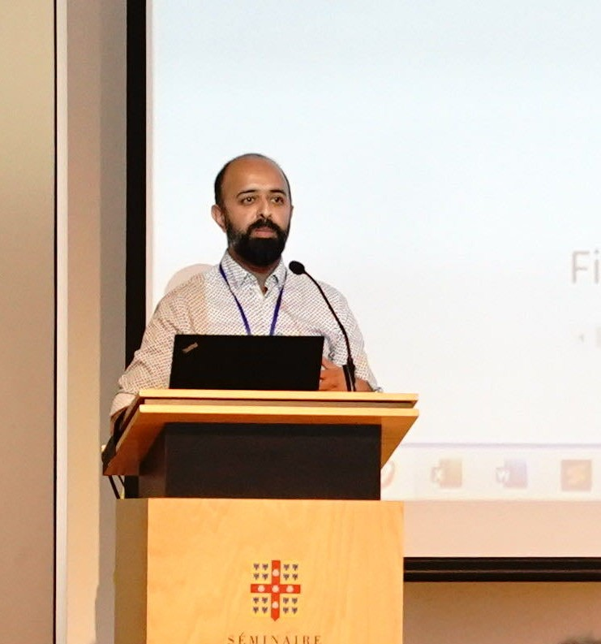

```{=html}
<section class="home-hero" aria-labelledby="home-title">
<div class="home-hero-main">
<p class="home-kicker">Mobility data science</p>
<h1 id="home-title">Researching movement, space, and health.</h1>
<p class="home-intro">I am a Research Fellow in Mobility Data Science in the School of Geography at the University of Leeds. My current research explores the mobility of healthcare workers and its impact on infection transmission within healthcare settings.</p>
<div class="home-actions" aria-label="Professional links">
<a href="publications.html">Publications</a>
<a href="cv.html">Curriculum vitae</a>
<a href="https://environment.leeds.ac.uk/geography-research-institute-spatial-data-science/staff/10166/keiran-suchak">Contact via University profile</a>
</div>
</div>
<aside class="home-profile">

<p>School of Geography<br>University of Leeds</p>
</aside>
</section>

<section class="home-focus-band" aria-labelledby="focus-title">
<div class="home-focus">
<div class="home-focus-heading">
<h2 id="focus-title">From individual movement to systems-level questions.</h2>
</div>
<div class="home-focus-items">
<article>
<h3>Healthcare mobility</h3>
<p>Exploring how the movement of healthcare workers shapes infection transmission in healthcare settings.</p>
</article>
<article>
<h3>Spatial modelling</h3>
<p>Developing methods for the real-time simulation of pedestrian and urban systems.</p>
</article>
<article>
<h3>Open research</h3>
<p>Building accessible computational tools and open-source software for mobility research.</p>
</article>
</div>
</div>
</section>

<section class="home-networks" aria-labelledby="networks-title">
<h2 id="networks-title">Working across spatial data science and mobility research.</h2>
<p>I am a member of the <a href="https://environment.leeds.ac.uk/geography-research-institute-spatial-data-science/">Institute for Spatial Data Science</a> and the <a href="https://mobscilab.com/">Mobility Science Lab</a>.</p>
<div class="home-actions" aria-label="Research profiles">
<a href="https://mobscilab.com/people/keiran-suchak/">MOB.SCI.LAB profile</a>
<a href="https://scholar.google.com/citations?user=RUJDDR4AAAAJ">Google Scholar</a>
<a href="https://github.com/ksuchak1990">GitHub</a>
</div>
</section>
```
